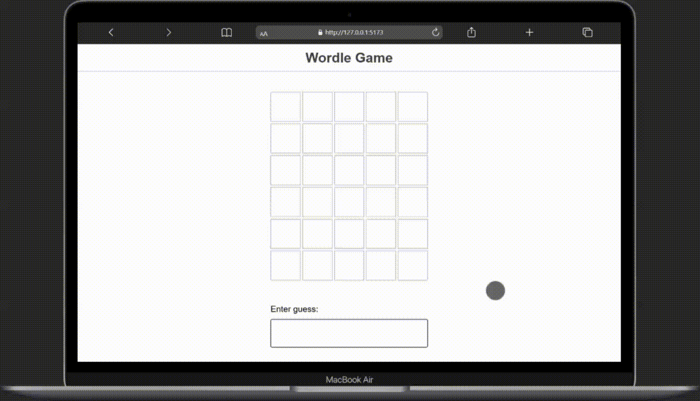

<h1 align="center">
    Wordle Game
</h1>


In Wordle, users have 6 attempts to guess a 5-letter word. You're helped along the way by ruling out letters that aren't in the word, and being told whether the correct letters are in the correct location or not.

## 💻 Getting started

#### Running the app

```bash
# Clone this repository
$ git clone https://github.com/gustavonobrega/wordle-game

# Go into the repository
$ cd wordle-game

# Install dependencies
$ pnpm install

# Run the app
$ pnpm run dev
```

---

<p align="center">Made with ♥ by Gustavo Nóbrega<p/>